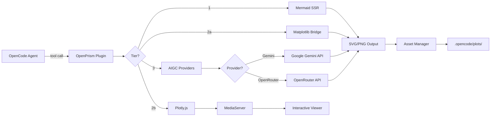

# OpenPrism


**Multi-tier drawing plugin for the OpenCode ecosystem** — bringing Mermaid diagrams, Matplotlib visualizations, Plotly.js interactive charts, and AIGC image generation to your AI coding agent.

OpenPrism extends [OpenCode](https://opencode.ai) with multi-tier visual capabilities, enabling your AI assistant to think, compute, and create visually.

---

## Features

| Tier | Engine | Capability |
|------|--------|------------|
| **1** | Mermaid | Architecture diagrams, flowcharts, sequence diagrams, ER diagrams, state machines |
| **2a** | Matplotlib | Static publication-quality plots — histograms, scatter charts, multi-panel figures |
| **2b** | Plotly.js | Interactive charts — zoom, pan, hover tooltips, legend toggle, data export |
| **3** | AIGC (Gemini / OpenRouter) | UI mockups, icons, creative assets, image editing — built-in multi-provider support |

### How It Works



### Hooks

OpenPrism also installs lifecycle hooks that enhance the agent automatically:

| Hook | Purpose |
|------|---------|
| `tool.execute.after` | Auto-detects and renders \`\`\`mermaid blocks in agent output |
| `experimental.chat.system.transform` | Injects tier-selection guidance into the system prompt |
| `experimental.session.compacting` | Preserves visual asset summaries during session compaction |
| `experimental.text.complete` | Embeds inline WebP thumbnails for image display in chat (data URI) |
| `experimental.chat.messages.transform` | Strips image data URIs before sending to LLM (zero context bloat) |

---

## Quick Start

### 1. Install

```bash
npm install openprism
```

### 2. Configure OpenCode

Add OpenPrism to your `opencode.json`:

```json
{
  "$schema": "https://opencode.ai/config.json",
  "plugin": ["openprism"]
}
```

### 3. (Optional) Install Tier Dependencies

**Tier 1 — Mermaid rendering:**

```bash
npm install -g @mermaid-js/mermaid-cli
```

**Tier 2a — Matplotlib (static plots):**

```bash
pip install matplotlib
```

> **Tier 2b — Plotly.js** requires no installation. The library is loaded from CDN when charts are viewed in the browser.

**Tier 3 — AIGC Image Generation (built-in, no external MCP required):**

Set at least one provider API key as an environment variable:

```bash
# Option A: Google Gemini (recommended — supports generation + editing)
export GEMINI_API_KEY="your-gemini-api-key"

# Option B: OpenRouter (supports generation via Seedream, etc.)
export OPENROUTER_API_KEY="your-openrouter-api-key"
```

OpenPrism auto-detects available providers. If both keys are set, Gemini is used by default.

**Supported models:**

| Provider | Models | Capabilities |
|----------|--------|--------------|
| Gemini | `gemini-2.5-flash-image` (default, fast, 1K) | Generate, edit, restore |
| Gemini | `gemini-3-pro-image-preview` (high quality, up to 4K) | Generate, edit, restore |
| OpenRouter | `bytedance-seed/seedream-4.5` (default) | Generate only |

> **Note**: You can also pass `model`, `aspectRatio`, `resolution`, and `style` parameters to the `generate_image` tool for fine-grained control.

---

## Available Tools

### `render_mermaid`

Renders Mermaid diagram source to SVG, PNG, or PDF.

| Parameter | Type | Required | Description |
|-----------|------|----------|-------------|
| `source` | string | yes | Mermaid diagram source code |
| `format` | `"svg"` \| `"png"` \| `"pdf"` | no | Output format (default: `svg`) |
| `theme` | `"default"` \| `"dark"` \| `"forest"` \| `"neutral"` | no | Mermaid theme |
| `description` | string | no | Human-readable description for asset tracking |

### `analyze_structure`

Scans the project directory and generates a Mermaid architecture diagram or ASCII tree.

| Parameter | Type | Required | Description |
|-----------|------|----------|-------------|
| `format` | `"mermaid"` \| `"text"` | no | Output format (default: `mermaid`) |
| `maxDepth` | number | no | Maximum scan depth (default: `4`) |
| `targetPath` | string | no | Relative path to analyze (default: project root) |

### `plot_data`

Executes a Python/Matplotlib script and saves the generated plot.

| Parameter | Type | Required | Description |
|-----------|------|----------|-------------|
| `script` | string | yes | Python script using `matplotlib.pyplot` |
| `description` | string | no | Description for asset tracking |
| `format` | `"png"` \| `"svg"` \| `"pdf"` | no | Output format (default: `png`) |
| `dpi` | number | no | DPI for raster output (default: `150`) |

The plugin automatically:
- Injects `matplotlib.use('Agg')` for headless rendering
- Appends `plt.savefig(...)` with the configured output path
- Strips any `plt.show()` calls from user scripts
- Detects `.venv`, conda, or system Python environments

### `plot_interactive`

Creates an interactive Plotly.js chart and returns a viewer URL that opens in the browser.

| Parameter | Type | Required | Description |
|-----------|------|----------|-------------|
| `spec` | string | yes | Plotly JSON spec as a string (must include `data`, `layout`, optional `config`) |
| `description` | string | no | Description for asset tracking |
| `data` | string | no | Plotly trace array as JSON string (used when `spec.data` is missing) |

The chart opens as a fully interactive HTML page via the built-in MediaServer:
- Zoom, pan, box/lasso select
- Hover tooltips with data values
- Legend toggle to show/hide traces
- Export to PNG via the Plotly toolbar

**When to use Matplotlib vs Plotly:**

| Scenario | Tool |
|----------|------|
| Data requires backend computation (read files, run algorithms) | `plot_data` (Matplotlib) |
| Data is available in conversation context | `plot_interactive` (Plotly) |
| Static publication-quality figure | `plot_data` (Matplotlib) |
| User wants to zoom, hover, or explore data | `plot_interactive` (Plotly) |

### `generate_image`

Generates or edits images via built-in AIGC providers (Gemini, OpenRouter).

| Parameter | Type | Required | Description |
|-----------|------|----------|-------------|
| `operation` | `"generate"` \| `"edit"` \| `"continue_editing"` \| `"restore"` | yes | AIGC operation type |
| `prompt` | string | yes | Text prompt for generation/editing |
| `sourcePath` | string | no | Source image path (required for `edit`/`restore`) |
| `referenceImages` | string[] | no | Reference image paths for style guidance |
| `model` | string | no | Provider model ID (e.g. `gemini-2.5-flash-image`, `bytedance-seed/seedream-4.5`) |
| `aspectRatio` | string | no | Aspect ratio (e.g. `1:1`, `16:9`, `4:3`) |
| `resolution` | string | no | Output resolution — `1K`, `2K`, or `4K` (Gemini Pro only) |
| `style` | string | no | Style hint (e.g. `photorealistic`, `cartoon`, `watercolor`) |

Provider is auto-detected from environment variables (`GEMINI_API_KEY` or `OPENROUTER_API_KEY`). Gemini supports all operations; OpenRouter supports generation only.

---

## Usage Examples

### Tier 1: Mermaid Diagrams

Simply include Mermaid code blocks in your conversation with the agent — OpenPrism will auto-render them:

```
User: Show me the authentication flow for our API.

Agent: Here's the sequence diagram:

    ```mermaid
    sequenceDiagram
        Client->>API: POST /login
        API->>DB: Validate credentials
        DB-->>API: User record
        API->>API: Generate JWT
        API-->>Client: 200 + token
    ```

[OpenPrism] Rendered Mermaid diagram -> .opencode/plots/mermaid/auto-mermaid-2025-01-15T10-30-00-a1b2.svg
```

Or use the `analyze_structure` tool to visualize your project:

```
User: Show me the project structure as a diagram.
Agent: (calls analyze_structure tool)
```

### Tier 2a: Matplotlib Plots (Static)

For heavy computation or publication-quality figures:

```
User: Plot the distribution of response times from our benchmark.

Agent: (calls plot_data with script)
    import matplotlib.pyplot as plt
    import numpy as np

    times = np.random.lognormal(mean=2, sigma=0.5, size=1000)
    plt.figure(figsize=(10, 6))
    plt.hist(times, bins=50, edgecolor='black', alpha=0.7)
    plt.xlabel('Response Time (ms)')
    plt.ylabel('Frequency')
    plt.title('API Response Time Distribution')
    plt.axvline(np.median(times), color='red', linestyle='--', label=f'Median: {np.median(times):.1f}ms')
    plt.legend()
```

### Tier 2b: Plotly.js Charts (Interactive)

For data exploration with zoom, hover, and toggle:

```
User: Compare the monthly sales of our three product lines.

Agent: (calls plot_interactive with spec)
    {
      "data": [
        {"x": ["Jan","Feb","Mar","Apr"], "y": [120,135,148,162], "name": "Product A", "type": "scatter"},
        {"x": ["Jan","Feb","Mar","Apr"], "y": [90,95,102,88],   "name": "Product B", "type": "scatter"},
        {"x": ["Jan","Feb","Mar","Apr"], "y": [45,52,58,71],    "name": "Product C", "type": "scatter"}
      ],
      "layout": {"title": "Monthly Sales Comparison", "xaxis": {"title": "Month"}, "yaxis": {"title": "Units"}}
    }

→ Opens an interactive chart in the browser where you can hover for values, toggle series, and zoom.
```

### Tier 3: AIGC Image Generation

With an API key configured, the agent can generate creative assets natively:

```
User: Generate a landing page mockup for a developer tools product.

Agent: (calls generate_image with operation: "generate")
       Prompt: "Modern landing page for a developer tools SaaS product..."
       → AIGC image generated successfully.
       → File: .opencode/plots/aigc/aigc-2025-01-15T10-30-00-x1y2.png
       → Format: png | Size: 245760 bytes | Provider: gemini | Model: gemini-2.5-flash-image
```

---

## Architecture

```
OpenPrism/
├── src/
│   ├── index.ts                          # Plugin entry point — exports OpenPrismPlugin
│   ├── types.ts                          # Shared type definitions for all tiers
│   ├── hooks/
│   │   ├── mermaid-renderer.ts           # Auto-renders mermaid blocks in agent output
│   │   ├── system-prompt.ts              # Injects tier-selection guidance into system prompt
│   │   ├── session-compaction.ts         # Preserves visual asset summaries during compaction
│   │   ├── text-complete-inline-image.ts # Embeds inline WebP thumbnails for image display
│   │   └── strip-images-transform.ts     # Strips image data URIs before LLM sees messages
│   ├── tools/
│   │   ├── render-mermaid.ts             # Tier 1: Mermaid render
│   │   ├── analyze-structure.ts          # Tier 1: Project structure → diagram
│   │   ├── plot-data.ts                  # Tier 2a: Matplotlib execution
│   │   ├── plot-interactive.ts           # Tier 2b: Plotly.js interactive charts
│   │   └── generate-image.ts             # Tier 3: AIGC image generation (native providers)
│   ├── providers/
│   │   ├── types.ts                      # AIGCProvider interface and config types
│   │   ├── gemini.ts                     # Google Gemini REST API provider
│   │   ├── openrouter.ts                 # OpenRouter API provider (Seedream, etc.)
│   │   └── index.ts                      # Provider registry and auto-detection factory
│   ├── renderers/
│   │   ├── mermaid-ssr.ts                # Mermaid CLI wrapper (mmdc)
│   │   └── matplotlib-bridge.ts          # Python subprocess bridge
│   └── utils/
│       ├── file-manager.ts               # Asset tracking, cleanup, manifest
│       ├── media-server.ts               # HTTP server for rich media viewing (Plotly, images, video)
│       ├── viewer-templates.ts           # HTML templates for image/video/Plotly viewers
│       ├── terminal-image.ts             # Kitty/iTerm2 image protocol support
│       └── thumbnail.ts                  # WebP thumbnail generation via Python PIL
├── tests/                                # Vitest — 137 tests, mirrors src/ structure
├── docs/plan.md                          # Development roadmap (Chinese)
├── package.json
├── tsconfig.json
├── LICENSE
└── README.md
```

---

## Prerequisites

| Requirement | Version | Required For |
|-------------|---------|--------------|
| Node.js | >= 18 | Core plugin |
| TypeScript | >= 5.0 | Build |
| @mermaid-js/mermaid-cli | >= 11.0 | Tier 1 (optional) |
| Python 3 | >= 3.8 | Tier 2a (optional) |
| matplotlib | latest | Tier 2a (optional) |
| GEMINI_API_KEY | — | Tier 3 via Gemini (optional) |
| OPENROUTER_API_KEY | — | Tier 3 via OpenRouter (optional) |

---

## Development Roadmap

The full development plan is documented in [`docs/plan.md`](docs/plan.md) (Chinese).

### Phase 1: Infrastructure and Mermaid Core (Weeks 1-2)
- Plugin scaffold and build pipeline
- Mermaid SSR rendering via `mermaid-cli`
- `tool.execute.after` hook for auto-rendering
- System prompt injection for tier-aware guidance

### Phase 2: Data Visualization Pipeline (Weeks 3-4)
- Python execution sandbox with environment detection
- Matplotlib bridge with Agg backend injection
- Static file serving integration
- Session compaction hooks for visual state preservation

### Phase 3: Native AIGC Providers (Weeks 5-6)
- Built-in multi-provider AIGC system (no external MCP dependency)
- Google Gemini provider — generation, editing, restore via REST API
- OpenRouter provider — generation via Seedream and other models
- Auto-detection from environment variables with explicit override support

### Phase 4: Unified Interface and Optimization (Weeks 7-8)
- Unified `/draw` command with tier selection
- Cross-tier orchestration (Mermaid -> Matplotlib pipeline)
- Automatic cleanup of expired assets
- Performance optimization and resource management

---

## Configuration

OpenPrism uses sensible defaults that can be customized:

| Setting | Default | Description |
|---------|---------|-------------|
| Output directory | `.opencode/plots` | Where generated assets are stored |
| Max output size | 500 MB | Triggers auto-cleanup when exceeded |
| Cleanup after | 30 days | Age threshold for expired assets |
| Mermaid enabled | `true` | Enable Tier 1 |
| Matplotlib enabled | `true` | Enable Tier 2a |
| Plotly enabled | `true` | Enable Tier 2b |
| AIGC enabled | `true` | Enable Tier 3 |

---

## License

MIT
