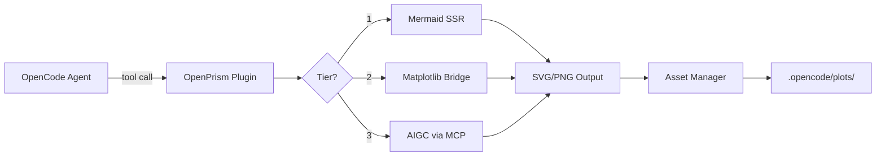

# OpenPrism

**Multi-tier drawing plugin for the OpenCode ecosystem** — bringing Mermaid diagrams, Matplotlib visualizations, and AIGC image generation to your AI coding agent.

OpenPrism extends [OpenCode](https://opencode.ai) with three tiers of visual capabilities, enabling your AI assistant to think, compute, and create visually.

---

## Features

| Tier | Engine | Capability |
|------|--------|------------|
| **1** | Mermaid | Architecture diagrams, flowcharts, sequence diagrams, ER diagrams, state machines |
| **2** | Matplotlib | Data plots, histograms, scatter charts, algorithm benchmarks, statistical visualizations |
| **3** | AIGC (MCP) | UI mockups, icons, creative assets, image editing via Nano Banana / Gemini |

### How It Works



### Hooks

OpenPrism also installs lifecycle hooks that enhance the agent automatically:

| Hook | Purpose |
|------|---------|
| `tool.execute.after` | Auto-detects and renders \`\`\`mermaid blocks in agent output |
| `experimental.chat.system.transform` | Injects tier-selection guidance into the system prompt |
| `experimental.session.compacting` | Preserves visual asset summaries during session compaction |

---

## Quick Start

### 1. Install

```bash
npm install openprism
```

### 2. Configure OpenCode

Add OpenPrism to your `opencode.json`:

```json
{
  "$schema": "https://opencode.ai/config.json",
  "plugin": ["openprism"]
}
```

### 3. (Optional) Install Tier Dependencies

**Tier 1 — Mermaid rendering:**

```bash
npm install -g @mermaid-js/mermaid-cli
```

**Tier 2 — Matplotlib:**

```bash
pip install matplotlib
```

**Tier 3 — AIGC via MCP:**

Add to your `opencode.json`:

```json
{
  "mcp": {
    "nano-banana": {
      "type": "local",
      "command": ["npx", "-y", "nano-banana-mcp"],
      "enabled": true,
      "environment": {
        "GEMINI_API_KEY": "{env:GEMINI_API_KEY}"
      }
    }
  }
}
```

---

## Available Tools

### `render_mermaid`

Renders Mermaid diagram source to SVG, PNG, or PDF.

| Parameter | Type | Required | Description |
|-----------|------|----------|-------------|
| `source` | string | yes | Mermaid diagram source code |
| `format` | `"svg"` \| `"png"` \| `"pdf"` | no | Output format (default: `svg`) |
| `theme` | `"default"` \| `"dark"` \| `"forest"` \| `"neutral"` | no | Mermaid theme |
| `description` | string | no | Human-readable description for asset tracking |

### `analyze_structure`

Scans the project directory and generates a Mermaid architecture diagram or ASCII tree.

| Parameter | Type | Required | Description |
|-----------|------|----------|-------------|
| `format` | `"mermaid"` \| `"text"` | no | Output format (default: `mermaid`) |
| `maxDepth` | number | no | Maximum scan depth (default: `4`) |
| `targetPath` | string | no | Relative path to analyze (default: project root) |

### `plot_data`

Executes a Python/Matplotlib script and saves the generated plot.

| Parameter | Type | Required | Description |
|-----------|------|----------|-------------|
| `script` | string | yes | Python script using `matplotlib.pyplot` |
| `description` | string | no | Description for asset tracking |
| `format` | `"png"` \| `"svg"` \| `"pdf"` | no | Output format (default: `png`) |
| `dpi` | number | no | DPI for raster output (default: `150`) |

The plugin automatically:
- Injects `matplotlib.use('Agg')` for headless rendering
- Appends `plt.savefig(...)` with the configured output path
- Strips any `plt.show()` calls from user scripts
- Detects `.venv`, conda, or system Python environments

### `generate_image`

Prepares AIGC image generation/editing requests for configured MCP servers.

| Parameter | Type | Required | Description |
|-----------|------|----------|-------------|
| `operation` | `"generate"` \| `"edit"` \| `"continue_editing"` \| `"restore"` | yes | AIGC operation type |
| `prompt` | string | yes | Text prompt for generation/editing |
| `sourcePath` | string | no | Source image path (required for `edit`/`restore`) |
| `referenceImages` | string[] | no | Reference image paths for style guidance |

---

## Usage Examples

### Tier 1: Mermaid Diagrams

Simply include Mermaid code blocks in your conversation with the agent — OpenPrism will auto-render them:

```
User: Show me the authentication flow for our API.

Agent: Here's the sequence diagram:

    ```mermaid
    sequenceDiagram
        Client->>API: POST /login
        API->>DB: Validate credentials
        DB-->>API: User record
        API->>API: Generate JWT
        API-->>Client: 200 + token
    ```

[OpenPrism] Rendered Mermaid diagram -> .opencode/plots/mermaid/auto-mermaid-2025-01-15T10-30-00-a1b2.svg
```

Or use the `analyze_structure` tool to visualize your project:

```
User: Show me the project structure as a diagram.
Agent: (calls analyze_structure tool)
```

### Tier 2: Matplotlib Plots

Ask the agent to create data visualizations:

```
User: Plot the distribution of response times from our benchmark.

Agent: (calls plot_data with script)
    import matplotlib.pyplot as plt
    import numpy as np

    times = np.random.lognormal(mean=2, sigma=0.5, size=1000)
    plt.figure(figsize=(10, 6))
    plt.hist(times, bins=50, edgecolor='black', alpha=0.7)
    plt.xlabel('Response Time (ms)')
    plt.ylabel('Frequency')
    plt.title('API Response Time Distribution')
    plt.axvline(np.median(times), color='red', linestyle='--', label=f'Median: {np.median(times):.1f}ms')
    plt.legend()
```

### Tier 3: AIGC Image Generation

With a configured MCP server (e.g., Nano Banana), the agent can generate creative assets:

```
User: Generate a landing page mockup for a developer tools product.

Agent: (calls generate_image with operation: "generate")
       Prompt: "Modern landing page for a developer tools SaaS product..."
```

---

## Architecture

```
OpenPrism/
├── docs/
│   └── plan.md                    # Development roadmap (Chinese)
├── src/
│   ├── index.ts                   # Plugin entry point — exports OpenPrismPlugin
│   ├── types.ts                   # Shared type definitions for all tiers
│   ├── hooks/
│   │   ├── mermaid-renderer.ts    # Auto-renders mermaid blocks in agent output
│   │   ├── system-prompt.ts       # Injects drawing tier guidance into system prompt
│   │   └── session-compaction.ts  # Preserves visual asset context during compaction
│   ├── tools/
│   │   ├── render-mermaid.ts      # Tier 1: Explicit Mermaid render tool
│   │   ├── analyze-structure.ts   # Tier 1: Project structure analysis
│   │   ├── plot-data.ts           # Tier 2: Matplotlib execution tool
│   │   └── generate-image.ts      # Tier 3: AIGC image generation tool
│   ├── renderers/
│   │   ├── mermaid-ssr.ts         # Mermaid CLI wrapper (mmdc)
│   │   └── matplotlib-bridge.ts   # Python subprocess bridge
│   └── utils/
│       ├── file-manager.ts        # Asset tracking, cleanup, manifest
│       └── terminal-image.ts      # Kitty/iTerm2 image protocol support
├── package.json
├── tsconfig.json
├── LICENSE
└── README.md
```

---

## Prerequisites

| Requirement | Version | Required For |
|-------------|---------|--------------|
| Node.js | >= 18 | Core plugin |
| TypeScript | >= 5.0 | Build |
| @mermaid-js/mermaid-cli | >= 11.0 | Tier 1 (optional) |
| Python 3 | >= 3.8 | Tier 2 (optional) |
| matplotlib | latest | Tier 2 (optional) |
| AIGC MCP server | varies | Tier 3 (optional) |

---

## Development Roadmap

The full development plan is documented in [`docs/plan.md`](docs/plan.md) (Chinese).

### Phase 1: Infrastructure and Mermaid Core (Weeks 1-2)
- Plugin scaffold and build pipeline
- Mermaid SSR rendering via `mermaid-cli`
- `tool.execute.after` hook for auto-rendering
- System prompt injection for tier-aware guidance

### Phase 2: Data Visualization Pipeline (Weeks 3-4)
- Python execution sandbox with environment detection
- Matplotlib bridge with Agg backend injection
- Static file serving integration
- Session compaction hooks for visual state preservation

### Phase 3: MCP AIGC Integration (Weeks 5-6)
- MCP client protocol layer (stdio + http transport)
- Nano Banana / Gemini image generation
- Semantic file naming and asset management
- API key security and permission prompts

### Phase 4: Unified Interface and Optimization (Weeks 7-8)
- Unified `/draw` command with tier selection
- Cross-tier orchestration (Mermaid -> Matplotlib pipeline)
- Automatic cleanup of expired assets
- Performance optimization and resource management

---

## Configuration

OpenPrism uses sensible defaults that can be customized:

| Setting | Default | Description |
|---------|---------|-------------|
| Output directory | `.opencode/plots` | Where generated assets are stored |
| Max output size | 500 MB | Triggers auto-cleanup when exceeded |
| Cleanup after | 30 days | Age threshold for expired assets |
| Mermaid enabled | `true` | Enable Tier 1 |
| Matplotlib enabled | `true` | Enable Tier 2 |
| AIGC enabled | `true` | Enable Tier 3 |

---

## License

MIT
