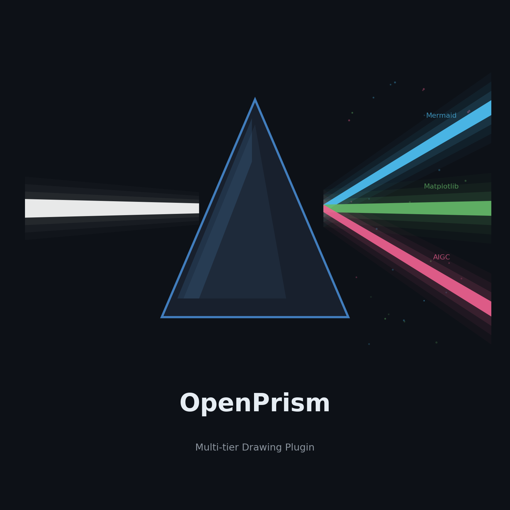
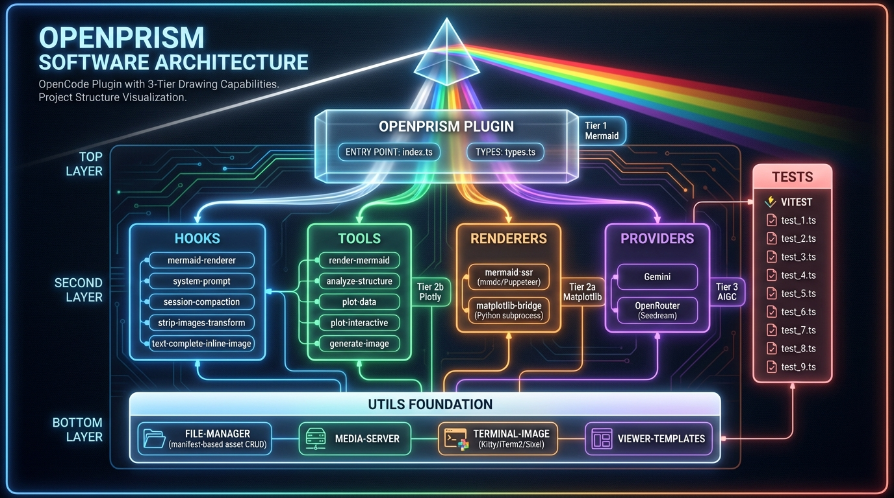
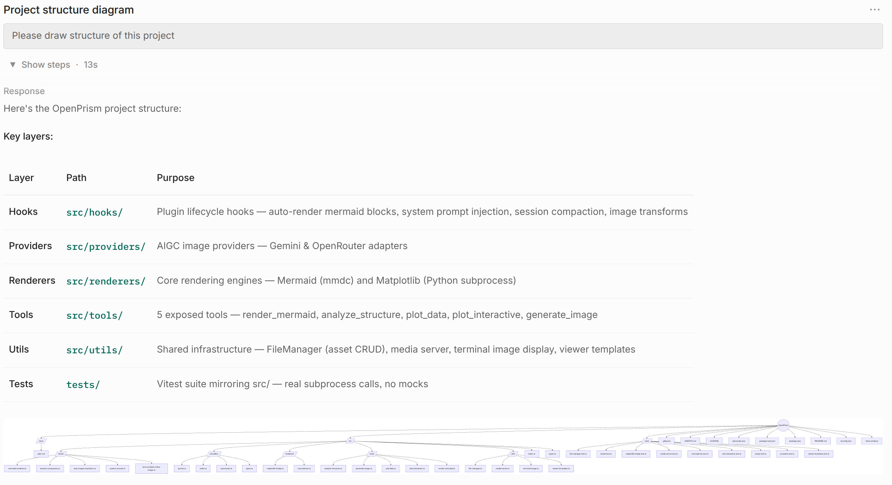
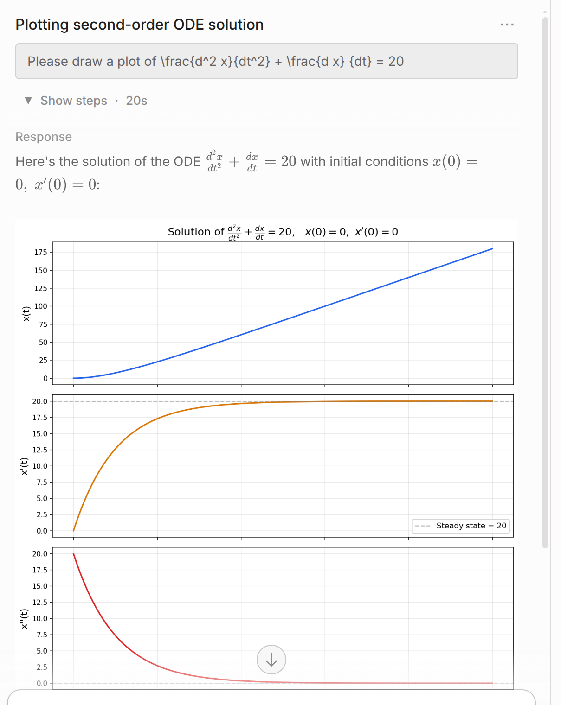
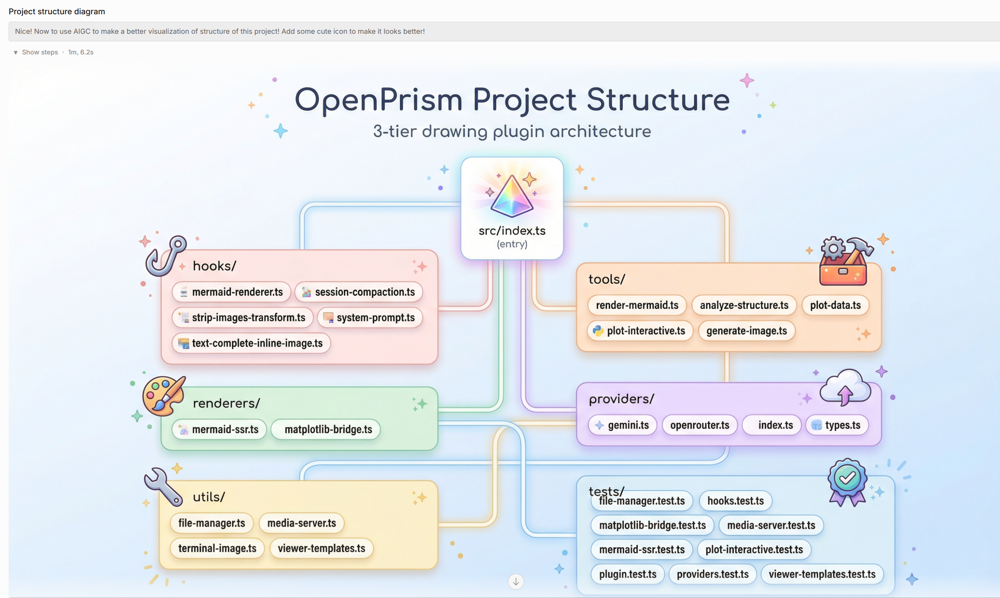
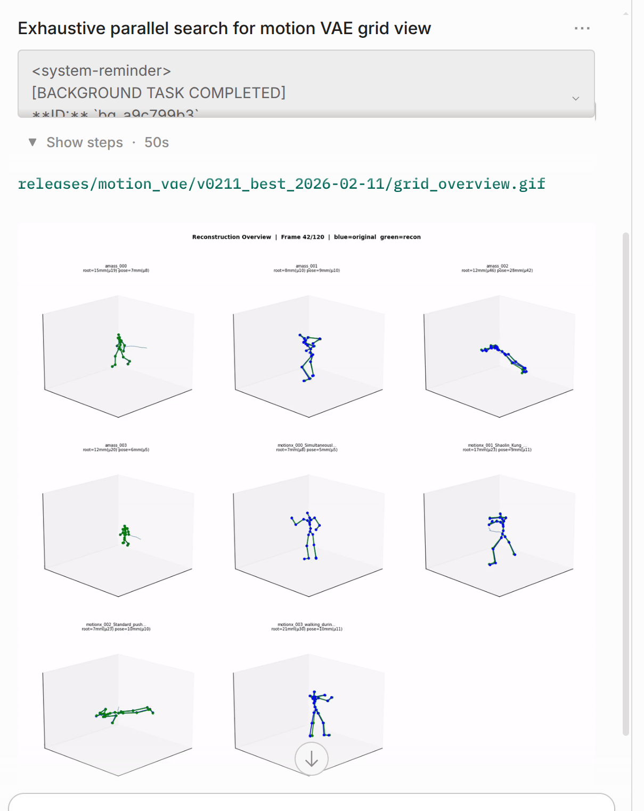
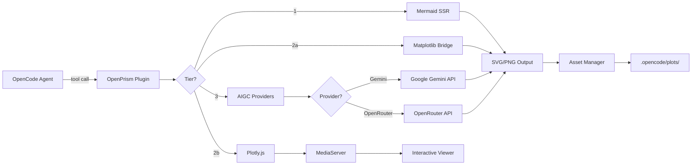

# OpenPrism

[中文快速跳转](#readme-zh)

<p align="center">
  
</p>

<p align="center">
  <a href="https://github.com/SOAR-Robotics-Lab/OpenPrism"></a>
  <a href="./LICENSE"></a>
</p>

<p align="center">
  
</p>

**Multi-tier drawing plugin for the OpenCode ecosystem** — bringing Mermaid diagrams, Matplotlib visualizations, Plotly.js interactive charts, and AIGC image generation to your AI coding agent.

OpenPrism extends OpenCode with multi-tier visual capabilities, enabling your AI assistant to think, compute, and create visually.

> **Version:** `0.1.0` (current)

---

## Contents

- [Why OpenPrism?](#why)
- [Features](#features)
- [Use Cases](#use-cases)
- [Modes: Web vs CLI](#modes)
- [Limitations (current)](#limitations)
- [Quick Start](#quick-start)
- [Available Tools](#tools)
- [About the authors / credits](#authors)
- [Open source](#oss)

<a id="why"></a>

## Why OpenPrism?

When doing research + engineering with coding agents, pure text is often not enough:

- New system design → you want a **flowchart / architecture diagram**
- Computation results → you want a **plot / chart**
- Complex design or user request → you want **AI-generated concept images / mockups**

OpenPrism is built to make “coding agent for research” feel more like a real lab notebook: **text + figures + diagrams**.

---

<a id="features"></a>

## Features

| Tier | Engine | Capability |
|------|--------|------------|
| **1** | Mermaid | Architecture diagrams, flowcharts, sequence diagrams, ER diagrams, state machines |
| **2a** | Matplotlib | Static publication-quality plots — histograms, scatter charts, multi-panel figures |
| **2b** | Plotly.js | Interactive charts — zoom, pan, hover tooltips, legend toggle, data export *(WIP in Web mode)* |
| **3** | AIGC (Gemini / OpenRouter) | UI mockups, icons, creative assets, image editing — built-in multi-provider support |

---

<a id="use-cases"></a>

## Use Cases

### Tier 1: Mermaid diagrams inside chat

Simply include Mermaid code blocks in your conversation. OpenPrism auto-renders them:



### Tier 2a: Matplotlib for static analysis plots



### Tier 2b: Plotly.js interactive charts

```json
{
  "data": [
    {"x": ["Jan", "Feb", "Mar", "Apr"], "y": [120, 135, 148, 162], "name": "Product A", "type": "scatter"},
    {"x": ["Jan", "Feb", "Mar", "Apr"], "y": [90, 95, 102, 88], "name": "Product B", "type": "scatter"},
    {"x": ["Jan", "Feb", "Mar", "Apr"], "y": [45, 52, 58, 71], "name": "Product C", "type": "scatter"}
  ],
  "layout": {"title": "Monthly Sales Comparison", "xaxis": {"title": "Month"}, "yaxis": {"title": "Units"}}
}
```

### Tier 3: AIGC image generation



### Existing visual result showcase



---

<a id="modes"></a>

## Modes: Web vs CLI

This plugin supports **Web mode** and **CLI mode**.

- **Interactive charts are currently supported only in CLI mode.**
- **AIGC generation in CLI mode is still unstable / has known issues.**

If you need interactivity today, prefer **CLI mode**. If you need AIGC reliability, prefer **Web mode** for now.

---

### How It Works



### Hooks

OpenPrism also installs lifecycle hooks that enhance the agent automatically:

| Hook                                   | Purpose                                                            |
| -------------------------------------- | ------------------------------------------------------------------ |
| `tool.execute.after`                   | Auto-detects and renders ```mermaid blocks in agent output         |
| `experimental.chat.system.transform`   | Injects tier-selection guidance into the system prompt             |
| `experimental.session.compacting`      | Preserves visual asset summaries during session compaction         |
| `experimental.text.complete`           | Embeds inline WebP thumbnails for image display in chat (data URI) |
| `experimental.chat.messages.transform` | Strips image data URIs before sending to LLM (zero context bloat)  |

---

<a id="limitations"></a>

## Limitations (current)

Due to OpenCode permission constraints:

1. **Click-to-zoom image may navigate away**, and when you come back the session *may* refresh.
   **Strongly recommended:** right-click the image and choose **Open in new tab**.

2. **Large image assets may crash the browser**, because we currently have to embed them into context using **base64 data URIs**.

3. When interacting with LLMs, **images are replaced by placeholders**.
   Generated images **cannot be kept inside LLM context** for now.

4. **Plotly.js interactive viewer is work-in-progress in Web mode.**
   (Interactive charts currently work in **CLI mode only**.)

We will actively explore submitting PRs to OpenCode to remove these constraints and provide a more ideal experience.

---

<a id="quick-start"></a>

## Quick Start

### Install (recommended right now)

> `npm` registry installation is **work-in-progress**. For now, we recommend installing directly from GitHub.

#### For humans

```bash
# 1) Install OpenPrism from GitHub
npm install github:SOAR-Robotics-Lab/OpenPrism

# 2) Enable it in OpenCode
# Add to opencode.json:
```

```json
{
  "$schema": "https://opencode.ai/config.json",
  "plugin": ["openprism"]
}
```

Then restart OpenCode.

#### For AI agents (copy/paste checklist)

* Install the plugin from GitHub:

  ```bash
  npm install github:SOAR-Robotics-Lab/OpenPrism
  ```
* Ensure `opencode.json` contains:

  ```json
  {
    "$schema": "https://opencode.ai/config.json",
    "plugin": ["openprism"]
  }
  ```
* Restart OpenCode session / reload workspace.
* If the user asks for diagrams/plots/images:

  * Prefer **Tier 1 Mermaid** for structure/process.
  * Prefer **Tier 2a Matplotlib** for computed plots.
  * Use **Tier 3 AIGC** when a visual concept/mockup is required.
  * If the user explicitly requires **interactive charts**, switch to **CLI mode**.

> Installation guide style inspired by: [https://github.com/code-yeongyu/oh-my-opencode](https://github.com/code-yeongyu/oh-my-opencode)

---

## (Optional) Tier Dependencies

### Tier 1 — Mermaid rendering

```bash
npm install -g @mermaid-js/mermaid-cli
```

### Tier 2a — Matplotlib (static plots)

```bash
pip install matplotlib
```

> **Tier 2b — Plotly.js** requires no installation. The library is loaded from CDN when charts are viewed in the browser. *(Web viewer is WIP; CLI supports interactivity today.)*

### Tier 3 — AIGC Image Generation (built-in, no external MCP required)

Set at least one provider API key as an environment variable:

```bash
# Option A: Google Gemini (recommended — supports generation + editing)
export GEMINI_API_KEY="your-gemini-api-key"

# Option B: OpenRouter (supports generation via Seedream, etc.)
export OPENROUTER_API_KEY="your-openrouter-api-key"
```

OpenPrism auto-detects available providers. If both keys are set, Gemini is used by default.

**Supported models:**

| Provider   | Models                                                | Capabilities            |
| ---------- | ----------------------------------------------------- | ----------------------- |
| Gemini     | `gemini-2.5-flash-image` (default, fast, 1K)          | Generate, edit, restore |
| Gemini     | `gemini-3-pro-image-preview` (high quality, up to 4K) | Generate, edit, restore |
| OpenRouter | `bytedance-seed/seedream-4.5` (default)               | Generate only           |

> You can also pass `model`, `aspectRatio`, `resolution`, and `style` parameters to the `generate_image` tool for fine-grained control.

---

<a id="tools"></a>

## Available Tools

### `render_mermaid`

Renders Mermaid diagram source to SVG, PNG, or PDF.

| Parameter     | Type                                              | Required | Description                                   |
| ------------- | ------------------------------------------------- | -------- | --------------------------------------------- |
| `source`      | string                                            | yes      | Mermaid diagram source code                   |
| `format`      | `"svg"` | `"png"` | `"pdf"`                       | no       | Output format (default: `svg`)                |
| `theme`       | `"default"` | `"dark"` | `"forest"` | `"neutral"` | no       | Mermaid theme                                 |
| `description` | string                                            | no       | Human-readable description for asset tracking |

### `analyze_structure`

Scans the project directory and generates a Mermaid architecture diagram or ASCII tree.

| Parameter    | Type                   | Required | Description                                      |
| ------------ | ---------------------- | -------- | ------------------------------------------------ |
| `format`     | `"mermaid"` | `"text"` | no       | Output format (default: `mermaid`)               |
| `maxDepth`   | number                 | no       | Maximum scan depth (default: `4`)                |
| `targetPath` | string                 | no       | Relative path to analyze (default: project root) |

### `plot_data`

Executes a Python/Matplotlib script and saves the generated plot.

| Parameter     | Type                        | Required | Description                             |
| ------------- | --------------------------- | -------- | --------------------------------------- |
| `script`      | string                      | yes      | Python script using `matplotlib.pyplot` |
| `description` | string                      | no       | Description for asset tracking          |
| `format`      | `"png"` | `"svg"` | `"pdf"` | no       | Output format (default: `png`)          |
| `dpi`         | number                      | no       | DPI for raster output (default: `150`)  |

The plugin automatically:

* Injects `matplotlib.use('Agg')` for headless rendering
* Appends `plt.savefig(...)` with the configured output path
* Strips any `plt.show()` calls from user scripts
* Detects `.venv`, conda, or system Python environments

### `plot_interactive` *(WIP in Web mode; works in CLI mode)*

Creates an interactive Plotly.js chart and returns a viewer URL that opens in the browser.

| Parameter     | Type   | Required | Description                                                                     |
| ------------- | ------ | -------- | ------------------------------------------------------------------------------- |
| `spec`        | string | yes      | Plotly JSON spec as a string (must include `data`, `layout`, optional `config`) |
| `description` | string | no       | Description for asset tracking                                                  |
| `data`        | string | no       | Plotly trace array as JSON string (used when `spec.data` is missing)            |

### `generate_image`

Generates or edits images via built-in AIGC providers (Gemini, OpenRouter).

| Parameter         | Type                                                         | Required | Description                                                 |
| ----------------- | ------------------------------------------------------------ | -------- | ----------------------------------------------------------- |
| `operation`       | `"generate"` | `"edit"` | `"continue_editing"` | `"restore"` | yes      | AIGC operation type                                         |
| `prompt`          | string                                                       | yes      | Text prompt for generation/editing                          |
| `sourcePath`      | string                                                       | no       | Source image path (required for `edit`/`restore`)           |
| `referenceImages` | string[]                                                     | no       | Reference image paths for style guidance                    |
| `model`           | string                                                       | no       | Provider model ID                                           |
| `aspectRatio`     | string                                                       | no       | Aspect ratio (e.g. `1:1`, `16:9`, `4:3`)                    |
| `resolution`      | string                                                       | no       | Output resolution — `1K`, `2K`, or `4K` (Gemini Pro only)   |
| `style`           | string                                                       | no       | Style hint (e.g. `photorealistic`, `cartoon`, `watercolor`) |

---

<a id="authors"></a>

## About the authors / credits

* **SOAR-LAB** is a robotics research team led by **Dr. Xu Hao** (SOAR-LAB, Flying General Intelligence Lab). Team members are currently mainly based at **Beihang University**.
* This project is co-developed with the **Mondo Robotics** engineering team, and funded by Mondo Robotics.
* Motivation: while tuning learning experiments, repeatedly digging through the filesystem for plots and artifacts is painful. Visualization is not a “nice-to-have” — it is essential for research workflows inside coding agents. OpenPrism was built (and open-sourced) to make that loop dramatically faster.
* Need help or found a bug? Please open an issue. Dr. Xu plans to deploy an agent to automatically collect feedback and turn it into actionable improvements.
* 100% vibe coding generated. Manual coding is dead. Vibe coding lives forever.

---

<a id="oss"></a>

## Open source

Repo: [https://github.com/SOAR-Robotics-Lab/OpenPrism](https://github.com/SOAR-Robotics-Lab/OpenPrism)

---

## License

MIT

---

<a id="readme-zh"></a>

# OpenPrism（中文）

[Back to English](#openprism)

<p align="center">
  
</p>

<p align="center">
  
</p>

**面向 OpenCode 生态的多层级绘图插件** ——把 Mermaid 结构图、Matplotlib 论文级可视化、Plotly.js 交互图表，以及 AIGC 图像生成带到你的 AI coding agent 里。

OpenPrism 为 OpenCode 增强多层级可视化能力，让你的 AI 助手不仅能“算”和“写”，还能“画”出来。

> **版本：** `0.1.0`（当前）

---

## 目录

- [为什么要做 OpenPrism？](#zh-why)
- [功能特性](#zh-features)
- [典型用例](#zh-use-cases)
- [模式说明：Web / CLI](#zh-modes)
- [当前限制（limitation）](#zh-limitations)
- [快速开始](#zh-quick-start)
- [作者说明 / 致谢](#zh-authors)
- [开源地址](#zh-oss)

---

<a id="zh-why"></a>

## 为什么要做 OpenPrism？

科研 + 工程里，纯文字经常不够用：

* 新系统设计 → 需要 **流程图 / 架构图**
* 计算结果 → 需要 **曲线图 / 统计图**
* 复杂设计或用户需求 → 需要 **AI 效果图 / 概念图**

OpenPrism 目标是把 coding agent 变成更像实验室笔记本：**文字 + 图 + 图表 + 结构图**。

---

<a id="zh-features"></a>

## 功能特性

| 层级     | 引擎                        | 能力                                  |
| ------ | ------------------------- | ----------------------------------- |
| **1**  | Mermaid                   | 架构图、流程图、时序图、ER 图、状态机                |
| **2a** | Matplotlib                | 静态论文级绘图——直方图、散点图、多子图                |
| **2b** | Plotly.js                 | 交互图表——缩放/平移/悬停提示/图例开关/导出（Web 模式开发中） |
| **3**  | AIGC（Gemini / OpenRouter） | UI 草图、图标、创意素材、图像编辑——内置多提供方          |

---

<a id="zh-use-cases"></a>

## 典型用例

### Tier 1：会话内 Mermaid 架构图

对话中直接写 Mermaid 代码块，OpenPrism 会自动渲染：


### Tier 2a：Matplotlib 静态分析图


### Tier 2b：Plotly.js 交互图表

```json
{
  "data": [
    {"x": ["Jan", "Feb", "Mar", "Apr"], "y": [120, 135, 148, 162], "name": "Product A", "type": "scatter"},
    {"x": ["Jan", "Feb", "Mar", "Apr"], "y": [90, 95, 102, 88], "name": "Product B", "type": "scatter"},
    {"x": ["Jan", "Feb", "Mar", "Apr"], "y": [45, 52, 58, 71], "name": "Product C", "type": "scatter"}
  ],
  "layout": {"title": "Monthly Sales Comparison", "xaxis": {"title": "Month"}, "yaxis": {"title": "Units"}}
}
```

### Tier 3：AIGC 图像生成


### 既有结果展示


---

<a id="zh-modes"></a>

## 模式说明：Web / CLI

本插件支持 **Web 模式** 与 **CLI 模式**。

* **可交互数据图表目前仅在 CLI 模式可用。**
* **CLI 模式下的 AIGC 生成仍有问题（不稳定/已知缺陷）。**

如果你现在就需要交互图表，优先使用 **CLI 模式**；如果你更依赖 AIGC 的稳定性，建议暂时优先使用 **Web 模式**。

---

<a id="zh-limitations"></a>

## 当前限制（limitation）

由于 OpenCode 本身的权限限制，导致：

1）图片单击放大时会跳转，并且返回时有可能会话被刷新；**强烈建议：右键 Open in new tab 放大查看**。
2）图片资源过大可能会引起浏览器崩溃，这是因为我们不得不用 base64 嵌入在上下文中。
3）跟 LLM 交互时图片会被替换为 placeholder，暂时不支持把生成的图片也放入上下文。
4）Plotly.js 的可交互插件 **Web 模式 work-in-progress**（CLI 模式已可用）。

作者会积极探索给 OpenCode 提 PR 解决限制，以获得更理想的体验！

---

<a id="zh-quick-start"></a>

## 快速开始

### 安装（当前推荐）

> 通过 `npm` 官方包管理器直接安装 **work-in-progress**。暂时推荐使用 **npm GitHub 安装**。

#### 给人类用户（for human）

```bash
# 1) 从 GitHub 安装 OpenPrism
npm install github:SOAR-Robotics-Lab/OpenPrism

# 2) 在 OpenCode 配置中启用
# 在 opencode.json 里加入：
```

```json
{
  "$schema": "https://opencode.ai/config.json",
  "plugin": ["openprism"]
}
```

然后重启 OpenCode。

#### 给 AI Agent（for AI agent，一键清单）

* 从 GitHub 安装：

  ```bash
  npm install github:SOAR-Robotics-Lab/OpenPrism
  ```
* 确保 `opencode.json` 包含：

  ```json
  {
    "$schema": "https://opencode.ai/config.json",
    "plugin": ["openprism"]
  }
  ```
* 重启 OpenCode 会话/刷新工作区。
* 当用户提出“画图/可视化/效果图”需求时：

  * 结构/流程优先用 **Tier 1 Mermaid**
  * 需要计算再画优先用 **Tier 2a Matplotlib**
  * 需要概念图/素材优先用 **Tier 3 AIGC**
  * 如果用户明确要求 **可交互图表**：切换到 **CLI 模式**

> 安装教程风格参考：[https://github.com/code-yeongyu/oh-my-opencode](https://github.com/code-yeongyu/oh-my-opencode)

---

##（可选）各层依赖

### Tier 1 — Mermaid 渲染

```bash
npm install -g @mermaid-js/mermaid-cli
```

### Tier 2a — Matplotlib（静态图）

```bash
pip install matplotlib
```

> **Tier 2b — Plotly.js** 无需安装，浏览器端通过 CDN 加载。（Web 交互 Viewer 仍在开发中；CLI 已可交互。）

### Tier 3 — AIGC 图像生成（内置，无需外部 MCP）

至少配置一个 API Key 环境变量：

```bash
# 方案 A：Google Gemini（推荐：支持生成 + 编辑）
export GEMINI_API_KEY="your-gemini-api-key"

# 方案 B：OpenRouter（支持生成，如 Seedream 等）
export OPENROUTER_API_KEY="your-openrouter-api-key"
```

OpenPrism 会自动检测可用提供方；如果两者都配置，默认优先 Gemini。

---

<a id="zh-authors"></a>

## 作者说明 / 致谢

* **SOAR-LAB（飞行通用智能实验室）** 是由 **徐浩博士** 领衔的机器人科研团队，成员目前主要位于 **北京航空航天大学**。
* 本项目由徐博士与 **妙动（Mondo Robotics）** 科技团队联合开发，并由妙动科技提供资助与工程支持。
* 项目缘起：在调 learning/实验时反复翻文件系统找结果极其低效——而在 coding agent 场景下，“随手可视化”对科研是刚需。OpenPrism 希望把这件事变得顺滑：该画就画，该算就算，结果就地展示。
* 如遇问题请直接提 issue；徐博士计划部署一个 agent 自动收集反馈、归纳共性问题，并持续迭代改进。
* 本项目 100% vibe coding 生成：古法手动编程已死，vibe coding 万岁！

---

<a id="zh-oss"></a>

## 开源地址

[https://github.com/SOAR-Robotics-Lab/OpenPrism](https://github.com/SOAR-Robotics-Lab/OpenPrism)

---

## License

MIT
